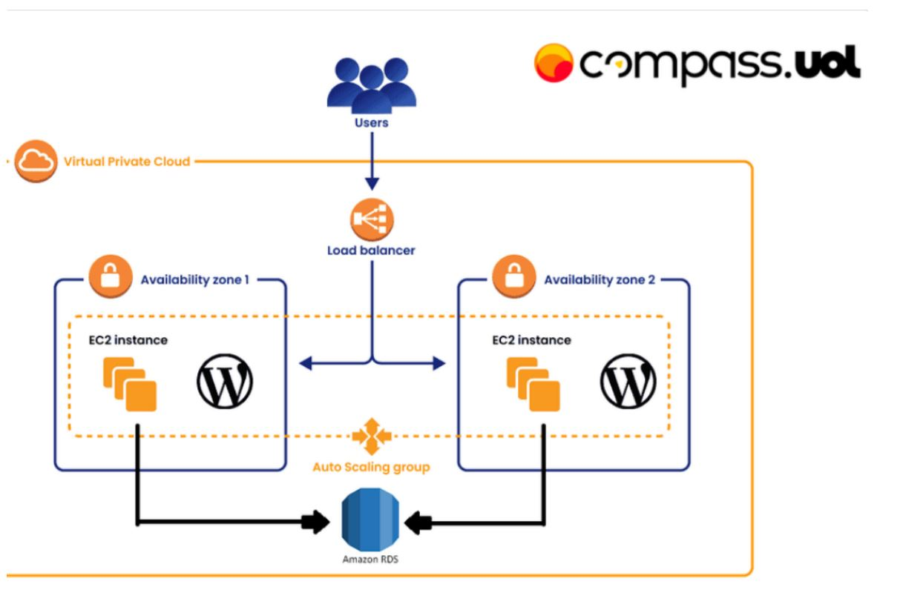
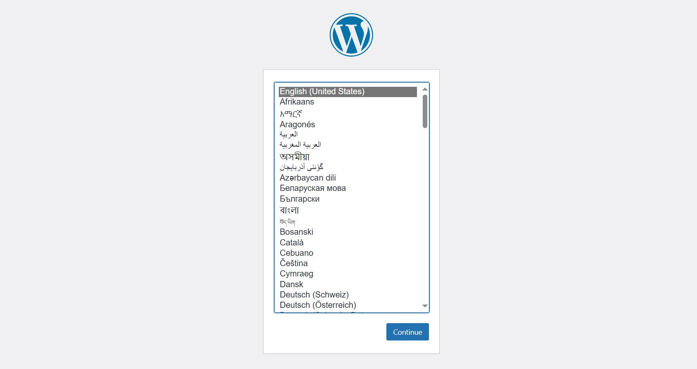

# ATIVIDADE-DEVSECOPS-DOCKER

## Atividade AWS DOCKER 
Para fixar os conhecimentos adquiridos durante o Módulo 3: Fundamentos de Docker e Conteinerização

### Objetivo Principal
- Efetuar o deploy de uma aplicação Wordpress em uma instância EC2 na AWS, utilizando Docker e Docker Compose.
- O projeto deve seguir a arquitetura abaixo.



  

## Índice
1. [Configurar uma VPC](#1-Criar-uma-VPC)
2. [Anexar internet Gateway a uma VPC](#2-Criar-um-internetgateway)
3. [Criar NAT Gateway](#3Configurar-um-nat-gateway)
4. [Configurar Route Tables](#4Configurar-a-tabela-de-rotas)
5. [Security Groups](#5Configurar-security-Groups)
6. [RDS](#6-create-rds)
7. [EFS](#7-configurar-efs)
8. [Criação das Instâncias](#8-intancia).
9. [Load Balancer](#9-lb)


## 1. VPC
### 1.1 Criar uma VPC
- No console home da AWS acesse o serviço VPC -> Selecione Your VPCs -> Create VPC
- Selecione a opção VPC and more

### 1.2 Configuração VPC
- Digite o nome da sua VPC: wordPress (escreva o nome de sua escolha)
  -Bloco CIDR IPV4: x.x.x.x/16
  - x.x.x.x Representa o endereço de IP principal
  - /16 Máscara de sub-rede padrão da VPC
  - Número de zonas de disponibilidade: 2 (como solicitada na arquitetura)

- Crie as subredes públicas e privadas uma para cada AZs(Zona de disponibilidade)
  - Número de subredes públicas: 2
  - Número de subredes privadas: 2

- Selecione Create VPC, para criar a vpc e finalizar esta etapa

### 1.3 Visualização da VPC 
Preview da VPC após as configurações


## 2. Crie um Internet Gateway
- Em VPC, selecione Internet Gateways
- Acesse create internet gateway e associe a VPC (Attach/Anexar)

## 3. NAT gateway
### 3.1 Criar um NAT gateway

- Selecione NAT gateways 
- Acesse create Nat gateway
   
   - Crie um nome ex: public-nat-gateway

- Conectividade: Public
   
   - Escolha uma subnet pública ex: public1-us-east-1a

- Selecione Allocate Elastic IP
- Clique em Create NAT gateway

## 4. Route Table

### 4.1 Editar a tabela de rotas
- Selecione Route Tables no serviço de VPC

- Selecione a rota ligada as public subnet

  -  Em seguida vá para route e selecione edit
  -  Adicione uma rota 0.0.0.0/0 (Todo tráfego)
  -  Associe as public subnet ao Target: Internet Gateway
  -  Clique em Save Changes

- Em seguida selecione as rotas associadas as private subnets

  -  Vá para route e selecione edit
  -  Adicione uma rota 0.0.0.0/0 (Todo tráfego)
  -  Associe as privatw subnet ao Target: NAT Gateway criado anteriormente
  -  Clique em Save Changes

## 5. Configurar os Security Groups
Digite EC2 na área de busca e clique em security groups
- Clique em create security groups
- Digite o nome do seu security group: (nome do seu sg)
- Selecione a vpc criada anteriormente

### 5.1 Criar Security Groups do RDS (Relational Database Service)
- Entrada/ Inbound:
   - MYSQL/Aurora: Port Range 3306 | Source Anwhere-IPv4-0.0.0.0/0
   - NFS: Source Anwhere-IPv4-0.0.0.0/0
- Saída Outbound:
   - All traffic - 0.0.0.0/0

### 5.2 Crie security group EFS (Elastic File System)
- Entrada/ Inbound:
  - NFS: Port Range 2049 | Source Anwhere-IPv4-0.0.0.0/0
- Saída Outbound:
  - All traffic - 0.0.0.0/0

### 5.3 Crie security group Load Balancer 
- Entrada/ Inbound:
  - HTTP: Port Range 80 |  Source Anwhere-IPv4-0.0.0.0/0
- Saída Outbound:
  - All traffic - 0.0.0.0

### 5.4 Crie o security group EC2
- Entrada/ Inbound:
  - HTTP: Port Range 80 |  Source Anwhere-IPv4-0.0.0.0/0
  - NFS: Port Range 2049 | Source Anwhere-IPv4-0.0.0.0/0
  - MYSQL/Aurora: Port Range 3306 | Source Anwhere-IPv4-0.0.0.0/0
  - SSH: Port Range 22 | Source: Custom my IP

- Saída Outbound:
  - All traffic - 0.0.0.0

### 5.5 Crie o security group EC2-Private
- Entrada/ Inbound:
  - HTTP: Port Range 80 |  Source: Custom sg-LoadBalancer
  - Custom TCP: Port Range 8000|  Source: Custom sg-EC2
  - SSH: Port Range 22 | Source: Custom sg-EC2
  
- Saída Outbound:
  - All traffic - 0.0.0.0

## 6. RDS-Amazon Relational Database Service
- Digite RDS na área de busca e clique em RDS
- Clique em create database  e escolha em Engine options: MySQL
- Em templates, selecione Free tier
- Settings:
  - Nome do seu banco
  - Credential settings:
    - Master username (Guarde user, name, password do DB, esses dados vão ser utilizados na configuração da instância) 
    - Materpassword 
- Instance configuration: db.t3.micro
- Connectivity:
   - VPC: escolha a vpc criada anteriormente
   - VPC security group: escolha RDS
- Public Acess: NO
- Additional configuration
   - Database name: database
- Selecione create database
- Copie e guarde o endpoint

## 7. EFS (Elastic File System)
- Digite EFS na área de busca e clique em EFS
- Clique em create file system
  - Digite um nome
  - Selecione a vpc
  - Clique em create
- Em network, selecione manage
   - Em mount target, selecione nas duas subnets o security group -> EFS
- Copie o DNS name do EFS e guarde em algum editor de texto.

## 8. Criação das instâncias EC2

É necessário criar duas instâncias para essse projeto

### 8.1 Instância em subnet pública (Bastion Host)
- No menu EC2-Selecione instances -> Create Instances
- Adicione o nome e tags necessárias
- Selecione Amazon AMI
- Selecione o tipo de instância, no caso utilizei t2.micro
- Chave .ppk para conectar via PuTTY
- Selecione o sg-EC2
- Selecione uma subnet pública, ex public1-us-east-1a
- Habilite o IP-público
- Crie a instância
  
### 8.2 Instância em subnet privada
- No menu EC2-Selecione instances -> Create Instances
- Adicione o nome e tags necessárias
- Selecione Amazon AMI
- Selecione o tipo de instância, no caso utilizei t2.micro
- Chave .pem para conectar via PuTTY
    - A chave .pem vai ser usada para acessar a instância privada via SSH, que está em uma rede segura e só pode ser acessada a partir do Bastion Host.
- Selecione o sg-ec2-private
- Selecione uma subnet privada em uma AZ diferente, ex private2-us-east-1b
- DESABILITE o IP-público
- Crie a instância
- Ao criar esta instância acesse:
     - Actions -> Networking -> Connect RDS database

### 8.3 Conexão o configuração das instâncias 
Conecte-se ao Bastion Host(Instância pública) via PuTTY
- Salve a chave .pem da outra instancia
    - Pode ser feito através editor de texto nano do bastion host
- Defina as permissões necessárias para a chave .pem
- Após salvar a chave .pem no bastion host conecte-se a instância privada via ssh
``` bash
ssh -i "nome-da-chave.pem" usuariod@endereco-ip-privado
```
- Ao acessar a a instância privada execute os comandos abaixos para Atualizar o sistema e instalar o docker
``` bash
yum update -y
yum install -y docker
```
- 
```bash
yum install -y docker

# Inicia e habilita o Docker
systemctl start docker
systemctl enable docker

# Verifica a instalação do Docker deu certo
docker --version
````
- 


## 9. Load balancer
- Digite EC2 na área de busca e clique em Load balancers
- Acesse create Application Load Balancer
  - Em Network mapping
       -Selecione a vpc e as duas subnets públicas
  - Em Security Groups escolha o LoadBalancer
  - Em Listeners and routing : Crie um novo Target Group
      - Target type: Instances
      - Name: escolha um nome
      - Protocol HTTP : Port 80
       - Adicione o TG a instância que está rodando o wordpress
  - Adicione o Target Group ao ALB
  - Selecione Create Load Balancer
  - Copie o DNS name do ALB e cole no navegador de sua preferência deve aparecer a página de configuração do Wordpress


  
### 10. Auto Scaling Group
### 10.1 Criar um launch template
Antes de criar o ASG é necessário criar um launch template no consolo ec2
  - Digite o nome
  - Escolha a AMI
     - Escolha o security group que tem como inboud HTTP e MYSQL/Aurora: launch template
     - Em advanced details cole esse script para automatizar a configuração da intância ec2
```bash
#!/bin/bash
# Atualiza o sistema
sudo dnf update -y

# Instala dependências necessárias
sudo dnf install -y dnf-plugins-core

# Adiciona e instala o Docker
sudo dnf config-manager --add-repo https://download.docker.com/linux/centos/docker-ce.repo
sudo dnf install docker-ce docker-ce-cli containerd.io -y

# Inicia e habilita o Docker
sudo systemctl start docker
sudo systemctl enable docker

# Executa o contêiner WordPress com Docker
sudo docker run -d --name wordpress \
  -p 80:80 \
  -e WORDPRESS_DB_HOST=(EndpointDoRDS) \
  -e WORDPRESS_DB_USER= #User do RDS \
  -e WORDPRESS_DB_PASSWORD=#Senha do RDS \
  -e WORDPRESS_DB_NAME=#Nome do RDS \
  --mount type=bind,source=/efs,target=/var/www/html \
  wordpress:latest
```

### 10.2 Criar Auto Scaling Group
- Digite o nome do ASG
- Selecione o Launch template criado no passo anterior
- Configure a escala inicial do ASG
- Selecione a VPC: wordPress
- Selecione as subnets privadas: 1a e 1b
- Load balancing
   - Selecione o application Load Balancer criado anteriormente
    - Configure a escabilidade das instâncias conforme a sua necessidade
- Crie o Auto Scaling Group

  
  
      
  

  
    


  

