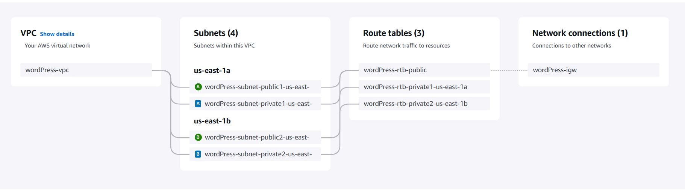

# ATIVIDADE-DEVSECOPS-DOCKER

## Atividade AWS DOCKER 
Para fixar os conhecimentos adquiridos durante o Módulo 3: Fundamentos de Docker e Conteinerização

### Objetivo Principal
- Efetuar o deploy de uma aplicação Wordpress em uma instância EC2 na AWS, utilizando Docker e Docker Compose.

## Índice
1. [Configurar uma VPC](#1-Criar-uma-VPC)
2. [Anexar internet Gateway a uma VPC](#2-Criar-um-internetgateway)
3. [Criar NAT Gateway](#3Configurar-um-nat-gateway)
4. [Configurar Route Tables](#4Configurar-a-tabela-de-rotas)
5. [Security Groups](#5Configurar-security-Groups)
6. [EFS](#6-configurar-efs)

## 1. VPC
### 1.1 Criar uma VPC
- No console home da AWS acesse o serviço VPC -> Selecione Your VPCs -> Create VPC
- Selecione a opção VPC and more

### 1.2 Configuração VPC
- Digite o nome da sua VPC: wordPress (escreva o nome de sua escolha)
  -Bloco CIDR IPV4: x.x.x.x/16
  - x.x.x.x Representa o endereço de IP principal
  - /16 Máscara de sub-rede padrão da VPC
  - Número de zonas de disponibilidade: 2 (como solicitada na arquitetura)

- Crie as subredes públicas e privadas uma para cada AZs(Zona de disponibilidade)
  - Número de subredes públicas: 2
  - Número de subredes privadas: 2

- Selecione Create VPC, para criar a vpc e finalizar esta etapa

### 1.3 Visualização da VPC 
Preview da VPC após as configurações

## 2. Crie um Internet Gateway
- Em VPC, selecione Internet Gateways
- Acesse create internet gateway e associe a VPC (Attach/Anexar)

## 3. NAT gateway
### 3.1 Criar um NAT gateway

- Selecione NAT gateways 
- Acesse create Nat gateway
   
   - Crie um nome ex: public-nat-gateway

- Conectividade: Public
   
   - Escolha uma subnet pública ex: public1-us-east-1a

- Selecione Allocate Elastic IP
- Clique em Create NAT gateway

## 4. Route Table

### 4.1 Editar a tabela de rotas
- Selecione Route Tables no serviço de VPC

- Selecione a rota ligada as public subnet

  -  Em seguida vá para route e selecione edit
  -  Adicione uma rota 0.0.0.0/0 (Todo tráfego)
  -  Associe as public subnet ao Target: Internet Gateway
  -  Clique em Save Changes

- Em seguida selecione as rotas associadas as private subnets

  -  Vá para route e selecione edit
  -  Adicione uma rota 0.0.0.0/0 (Todo tráfego)
  -  Associe as privatw subnet ao Target: NAT Gateway criado anteriormente
  -  Clique em Save Changes

## 5. Configurar os Security Groups
Digite EC2 na área de busca e clique em security groups
### 5.1 Criar 2 Security Groups
- Clique em create security groups
- Digite o nome do seu security group
- Selecione a vpc criada

   - Entrada/ Inbound:
        -  HTTP : Source Anwhere-IPv4-0.0.0.0/0
        -  SSH: Source Anwhere-IPv4-0.0.0.0/0
        -  MYSQL/Aurora Source Anwhere-IPv4-0.0.0.0/0
        -  NFS: Source Anwhere-IPv4-0.0.0.0/0

   -  Saída Outbound:
       	- All traffic - 0.0.0.0/0
        
- Crie o segundo security group
   - Entrada/ Inbound:
        -  HTTP : Source Anwhere-IPv4-0.0.0.0/0
        -  SSH: Source Custom -> public-security-group
   
   -  Saída Outbound:
       	- All traffic - 0.0.0.0/0

  ## 6. EFS
  
      
  

  
    

  

